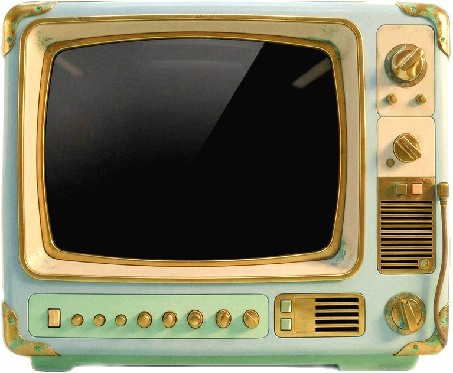

# 🤖 AGENTS.md — Полный контекст для разработчика

## 1. Общая концепция и стилистика

Разработать легковесный одностраничный лендинг, главным элементом которого является стилизованный ретро-телевизор (вдохновлённый Fallout и сериалом «Здравствуй, будущее!»). На экране телевизора будет проигрываться видео‑презентация, переключаемая с помощью интерактивных кнопок на корпусе телевизора. Поддерживаются **два видеохостинга: YouTube и VK Video**. Страница должна вовлекать пользователя за первые 7 секунд, минимизируя текст.

**Цветовая гамма и стиль:** пастельные тона (мятный, кремовый, приглушённый оранжевый), лёгкая состаренность, потёртость. Настроение — игривое, саркастичное, тёплое. Ракурс основного фона — строго фронтальный (90° к зрителю), телевизор занимает центральное место.

## 2. Структура проекта

```
project/landing/
├── QWEN.md              # Этот файл с документацией
└── source/              # Все графические ресурсы
    ├── backstage.jpeg   # Основной фон страницы
    ├── tv.png           # Изображение телевизора
    ├── cipan_1.png      # Игрушка: состояние 1 (исходное)
    ├── cipan_2.png      # Игрушка: состояние 2 (после клика)
    ├── cipan_3.png      # Игрушка: состояние 3 (после двойного клика)
    ├── djoystick.png    # Джойстик (статичный)
    ├── catridge.png     # Картридж (статичный)
    ├── console.png      # Приставка (статичный)
    ├── redbutton_2.png  # Кнопка YouTube (для карты телевизора)
    ├── bluebutton_2.png # Кнопка VK Video (для карты телевизора)
    ├── redbutton.png    # Доп. красная кнопка
    ├── bluebutton.png   # Доп. синяя кнопка
    └── freepik__assistant__16833.jpeg  # Дополнительный ресурс
```

**Требуемые файлы для создания:**
- `index.html` — основная разметка страницы
- `styles.css` — стили и адаптивная вёрстка
- `scripts.js` — логика интерактивности

## 3. Разметка областей

### 3.1. Области на фоне (`backstage.jpeg`)

Использовать контейнер с абсолютным позиционированием. Координаты нужно конвертировать в проценты для адаптивности.

```html
<div class="imgmap_css_container" id="imgmap202636144235">
  <!-- Область телевизора -->
  <a style="position: absolute; top: 185px; left: 315px; width: 544px; height: 370px;" alt="1" href="#tv"><em></em></a>
  <!-- Область игрушки -->
  <a style="position: absolute; top: 445px; left: 154px; width: 112px; height: 132px;" alt="2" href="#toy"><em></em></a>
  <!-- Область джойстика -->
  <a style="position: absolute; top: 627px; left: 270px; width: 86px; height: 80px;" alt="3" href="#joystick"><em></em></a>
  <!-- Область картриджа -->
  <a style="position: absolute; top: 599px; left: 834px; width: 132px; height: 104px;" alt="4" href="#cartridge"><em></em></a>
  <!-- Область приставки -->
  <a style="position: absolute; top: 594px; left: 490px; width: 196px; height: 72px;" alt="5" href="#console"><em></em></a>
</div>
```

### 3.2. Карта изображения телевизора (`tv.png`)

```html

<map id="tvmap" name="tvmap">
  <area shape="rect" alt="0" coords="98,86,550,422" href="#video">      <!-- Экран -->
  <area shape="rect" alt="1" coords="668,308,688,328" href="#youtube">  <!-- Кнопка YouTube -->
  <area shape="rect" alt="2" coords="694,308,714,328" href="#vk">       <!-- Кнопка VK -->
  <area shape="rect" alt="3" coords="472,506,496,528" href="#youtube">  <!-- Дубль YouTube -->
  <area shape="rect" alt="4" coords="472,538,496,562" href="#youtube">  <!-- Дубль YouTube -->
  <area shape="rect" alt="5" coords="78,522,104,556" href="#placeholder"><!-- Заглушка -->
</map>
```

## 4. Интерактивность

### 4.1. Телевизор

| Область | Действие |
| :--- | :--- |
| `alt="0"` (экран) | Отображение iframe с видео |
| `alt="1"` (красная кнопка) | Переключение на YouTube |
| `alt="2"` (синяя кнопка) | Переключение на VK Video |
| `alt="3"`, `alt="4"` | Дублируют YouTube |
| `alt="5"` | Заглушка ("Скоро...") |

**Функция:** `switchVideo(platform)` где `platform` — `'youtube'` или `'vk'`

### 4.2. Игрушка (область alt="2" на фоне)

| Состояние | Файл | Триггер |
| :--- | :--- | :--- |
| 1 | `cipan_1.png` | Исходное |
| 2 | `cipan_2.png` | Одинарный клик |
| 3 | `cipan_3.png` | Двойной клик |

**Логика:**
- Одинарный клик → `cipan_2.png`
- Двойной клик → `cipan_3.png` (приоритет, независимо от текущего состояния)

### 4.3. Остальные области

- `alt="3"` (джойстик), `alt="4"` (картридж), `alt="5"` (консоль) — пока без интерактивности, только `preventDefault()`

### 4.4. Футер

Нижняя панель должна содержать:
- Ссылка на GitHub
- Ссылка на HeadHunter
- Кнопка "Оплата подписки"
- Кнопка "Условия"

## 5. Технические требования

- **Стек:** HTML5, CSS3 (Flexbox/Grid), Vanilla JS
- **Адаптивность:** Mobile First, масштабирование областей через проценты или JS
- **Производительность:** Ленивая загрузка iframe (создание по клику)
- **Обработка событий:** `preventDefault()` на всех кликах по областям

## 6. Конфигурация (плейсхолдеры)

```javascript
// scripts.js
const videoEmbeds = {
    youtube: 'https://www.youtube.com/embed/...', // Вставить позже
    vk: 'https://vk.com/video_ext.php?...'        // Вставить позже
};

const toySounds = {
    singleClick: 'path/to/sound1.mp3',  // Будет добавлено позже
    doubleClick: 'path/to/sound2.mp3'   // Будет добавлено позже
};
```

## 7. Чеклист реализации

- [ ] Создать `index.html` с базовой разметкой
- [ ] Создать `styles.css` с адаптивным позиционированием
- [ ] Создать `scripts.js` с логикой переключения видео
- [ ] Реализовать интерактивность игрушки (3 состояния)
- [ ] Добавить футер с ссылками
- [ ] Протестировать адаптивность на мобильных устройствах
- [ ] Оптимизировать изображения (сжатие)
